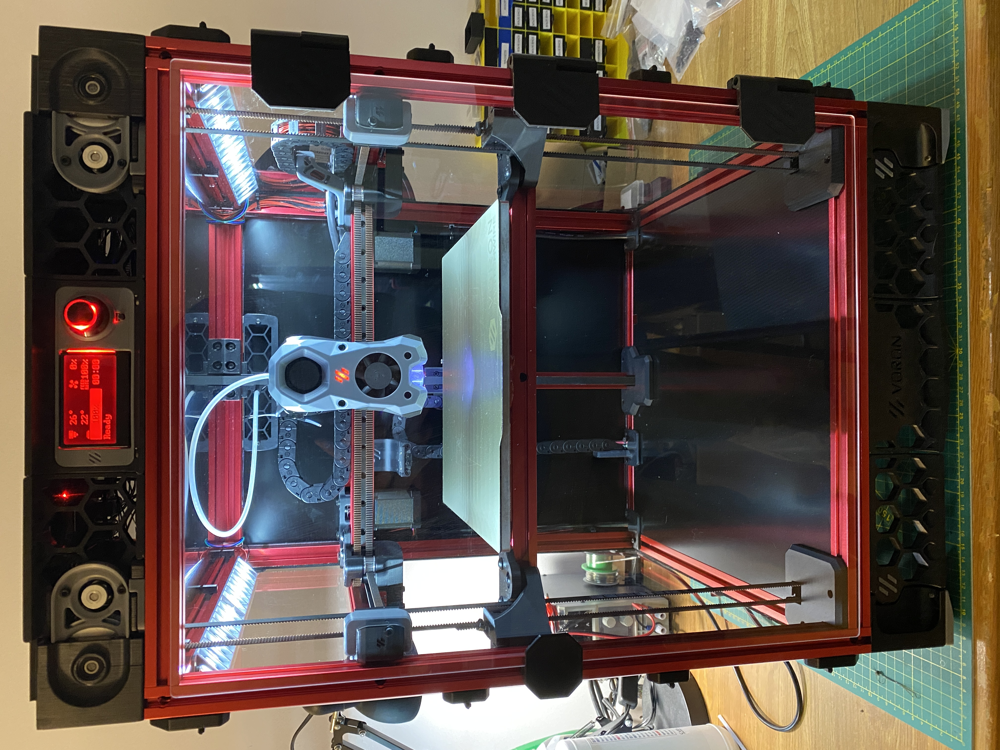

# Orion Tri-Belt

A mod of a Voron Trident that replaces the 3 leadscrews with belts and modified Z-Drives from a 2.4.  This is in the very early stages of development and though a fully funtional printer has been built some of the parts are not yet fully tested.  The existing printer is producing excellent prints though many changes will be coming in the following months.  

This first version places the Low Voltage Electronics up top, though I do hope to create a version in the future which is more closely matched to a stock Trident Build.  The second version will have the Z drives and low voltage electronics located on the bottom as in a Voron 2.4.

A huge thank you to Clee for lots of help in planning, designing and generally supporting the development of this 3Dprinter.  

## Why?
Since this is the most common question when posting about this printer I will get this out of the way.  
  1. Much higher Z speeds and accelerations when compared to lead screws.  Tested so far at 200mm/s and 1000mm/s^2 without issues.
  2. Avoids the usual drawbacks of leadscrews regarding wobble and backlash.
  3. Similar cost to a trident with lead screws given the relativly high cost of Steppers with integrated lead screws.
  4. Why not?

The cost of this modification is approximatly $145 USD.  If the 3 Steppers with lead screws are not purchased the cost over a stock trident build is approximatly $40 USD.

## CAD
Due to max size for files on GitHub the CAD file can be downloaded with this link.  There is a greatly trimmed down file available in the CAD folder but this link contains the most up to date model.  https://www.dropbox.com/s/bkrurjnszwhw9md/Orion%20Tri-Belt.step?dl=0

## BOM
The following is a list of parts required in addition to the Trident Stock Build.

### Electronics	
| Item | Qty |
| - | - |
| Nema 17 Stepper	| 3
	
### Motion	

| Item | Qty |
| - | - |
| 6mmx188mm GT2 Belt Loop | 3 |
|9MM Gt2 Belt (Meters)	|      3.5
|Pulley GT2 16 Tooth, 6mm	|  3
|Pulley GT2 80 Tooth, 6mm	|  3
|Pulley GT2 20 Tooth, 9mm	|  3
|Idler GT2 20 Tooth, 9mm	|  3
|50x60 D-Shaft	|  3
|Bearing 625-2RS	|  9

### Fastners	
| Item | Qty |
| - | - |
|M5x30 BHCS	|  3
|M5x10 BHCS	|  12+
|M5x40 SHCS	|  6
|M3x16 SHCS	|  3
|M3x40 SHCS	|  18
|M3 Heatsets	|  20
|M3x8 SHCS | Yes

Upper Deck Panel- Easily made from a modified Electronics Panel.

